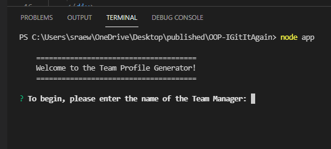

# Team Profile Generator

## Purpose

A command-line application that accepts user input and generates an HTML page that presents a team roster.

----

## Preview

Here is how the application appears and functions.


The full walk-through video can be found [here!](https://youtu.be/z3ynpdiOIHk)

## Installation
_This project requires Node.js_
[How to install](https://docs.npmjs.com/downloading-and-installing-node-js-and-npm)

After you have installed Node, use the CLI to clone this repository.
```git@github.com:wolfgarb/OOP-IGitItAgain.md```

Once cloned, you can use the command ``node app`` to initialize the application and walk through the ``inquirer`` prompts.



After the user has chosen to finish building their team, the ``index.html`` file will be found in the ``/dist`` folder.

## Tests
_This project utilized Jest for testing_

Here is a preview of this project passing the test suite.
The full video can be found [here](https://youtu.be/ZYW6_WB1AIo)


## Feedback

Have something you'd like to add?<br> 
Feel free to contact me via email!<br>
[Email Me](mailto:sraewolfskill@gmail.com)

